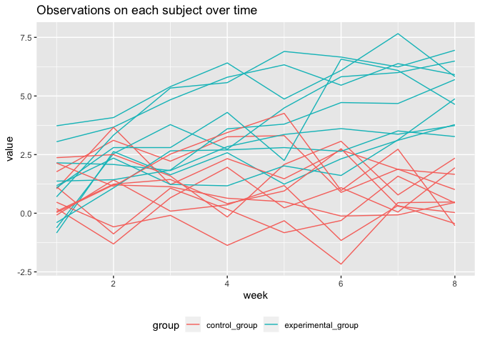
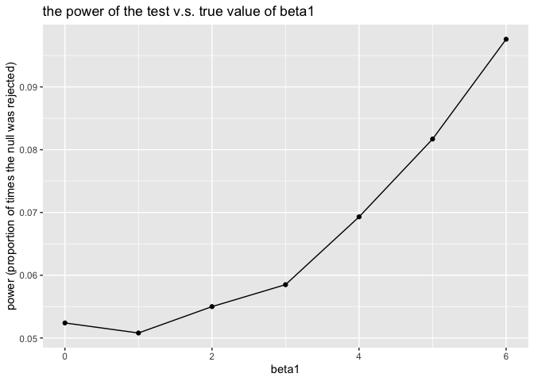
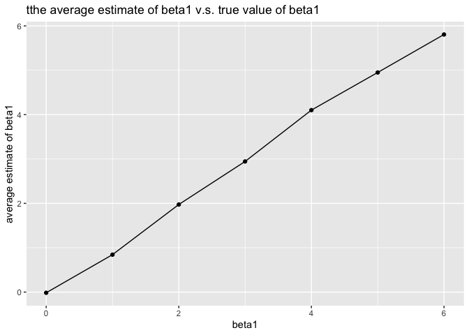
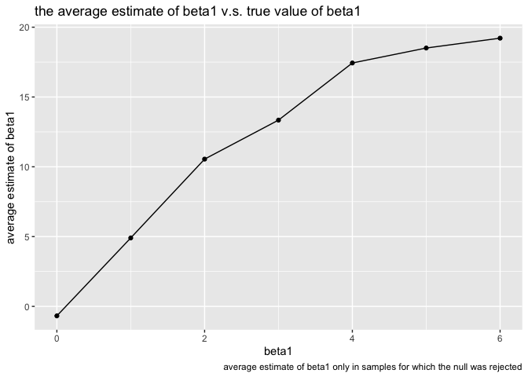

p8105\_hw5\_xc2473
================

``` r
library(tidyverse)
```

    ## ── Attaching packages ────────────────────────────────────────────────────────────── tidyverse 1.2.1 ──

    ## ✔ ggplot2 3.2.1     ✔ purrr   0.3.2
    ## ✔ tibble  2.1.3     ✔ dplyr   0.8.3
    ## ✔ tidyr   1.0.0     ✔ stringr 1.4.0
    ## ✔ readr   1.3.1     ✔ forcats 0.4.0

    ## ── Conflicts ───────────────────────────────────────────────────────────────── tidyverse_conflicts() ──
    ## ✖ dplyr::filter() masks stats::filter()
    ## ✖ dplyr::lag()    masks stats::lag()

``` r
set.seed(10)

iris_with_missing = iris %>% 
  map_df(~replace(.x, sample(1:150, 20), NA)) %>%
  mutate(Species = as.character(Species))
```

**Problem 1**

``` r
filling = function(x) {
  
  if (is.numeric(x)) {
    x[is.na(x)] = mean(x, na.rm = TRUE)

  }else if (!is.numeric(x)) {
     x[is.na(x)] = "virginica" 
    }
    
  x
}

output1 = map_dfr(iris_with_missing, filling) %>% 
  mutate_if(is.numeric, round, digits = 1)
```

**Problem 2**

``` r
l = list.files("./data/")

readfile = function(filename) {

  r = read_csv(file = paste0("./data/", filename), col_types = cols())
  
  c(file_name = filename, r)

}

output2 = purrr::map(l, readfile) %>% 
  bind_rows() %>% 
  separate(file_name, into = c("group", "ID"), sep = "_") %>% 
  mutate(
    ID = str_replace(ID, ".csv", " ")) %>% 
  pivot_longer(
    week_1:week_8,
    names_to = "week",
    names_prefix = "week_",
    values_to = "value"
  ) %>% 
  mutate(week = as.numeric(week),
         group = recode(group, `con` = "control_group", `exp` = "experimental_group")
  )

output2 %>% 
  ggplot(aes(x = week, y = value, color = group, group = interaction(group, ID))) +
  geom_line() +
  labs(
    title = "Observations on each subject over time"
  ) +
  theme(legend.position = "bottom") 
```

<!-- -->

From the spaghetti plot, we can see that the average observed value
among experimental groups was obviously higher than that among control
groups.

**Problem 3**

``` r
library(broom)

sim_regression = function(beta1, n = 30, beta0 = 2, variance = 50) {
  
  sim_data = tibble(
    xi1 = rnorm(n, mean = 0, sd = 1),
    ϵi = rnorm(n, 0, variance),
    yi = beta0 + beta1 * xi1 + ϵi
  )
  
 ls_fit = lm(yi ~ xi1, data = sim_data)
 
 broom::tidy(ls_fit)
 
}

sim_results = 
  tibble(beta1 = c(0, 1, 2, 3, 4, 5, 6)) %>% 
  mutate(
    output_list = map(.x = beta1, ~rerun(10000, sim_regression(beta1 = .x))),
    estimate = map(output_list, bind_rows)) %>% 
  select(-output_list) %>% 
  unnest(estimate) %>% 
  filter(term == "xi1") %>% 
  select(beta1, estimate, p.value)

sim_power = 
  sim_results %>% 
  mutate(rejected = ifelse(p.value <= 0.05, 1, 0)) %>% 
  group_by(beta1) %>% 
  summarize(power = mean(rejected))

sim_power %>% 
  ggplot(aes(x = beta1, y = power)) + 
  geom_point() +
  geom_line() +
  labs(
    y = "power (proportion of times the null was rejected)",
    title = "the power of the test v.s. true value of beta1"
  )
```

<!-- -->

From the graph, we can see that as the value of beta1, the power of test
increased. Since the effect size or estimate value of beta1 is postively
related to the true value of beta1, the effect size and power are also
positively related.

``` r
sim_beta1_hat =
  sim_results %>% 
  group_by(beta1) %>% 
  summarize(mean_estimate = mean(estimate))

sim_beta1_hat_among_rejected =
  sim_results %>% 
  filter(p.value <= 0.05) %>% 
  group_by(beta1) %>% 
  summarize(mean_estimate = mean(estimate))
  
sim_beta1_hat %>% 
  ggplot(aes(x = beta1, y = mean_estimate)) + 
  geom_point() +
  geom_line() +
  labs(
    y = "average estimate of beta1",
    title = "tthe average estimate of beta1 v.s. true value of beta1"
  )
```

<!-- -->

``` r
sim_beta1_hat_among_rejected %>% 
  ggplot(aes(x = beta1, y = mean_estimate)) + 
  geom_point() +
  geom_line() +
  labs(
    y = "average estimate of beta1",
    title = "the average estimate of beta1 v.s. true value of beta1",
    caption = "average estimate of beta1 only in samples for which the null was rejected"
  )
```

<!-- -->

From the graph, we can see that the averages of estimated beta1 across
tests for which the null was rejected were very different from the true
values of beta1, except the beta1 was equal to 0.

Reason: The null is more likely to be rejected when the effect size
(estimated value of beta1) is larger. Therefore, the average values of
estimated beta1 under the situation for which the null was rejected were
higher than the true values of beta1, which were approximately equal to
the average values of estimated beta1 under any situation.
